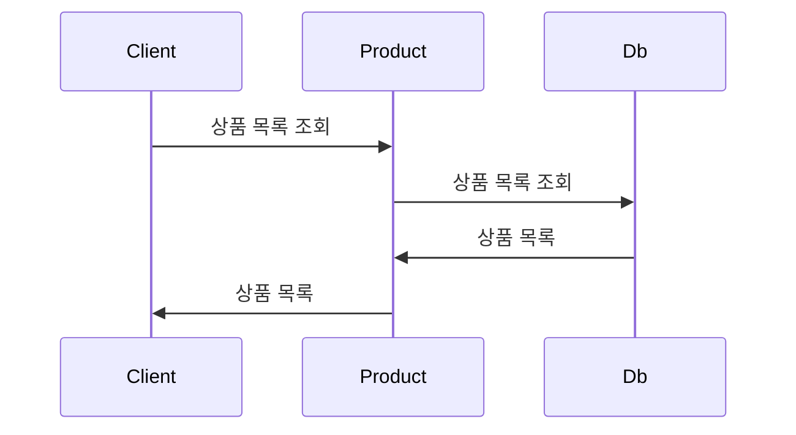
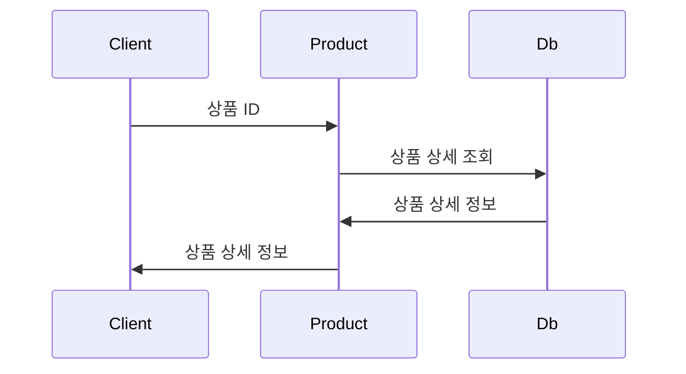
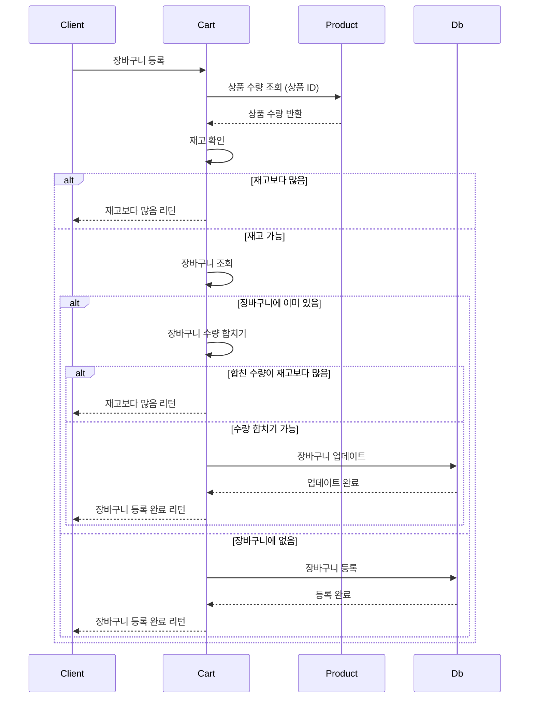
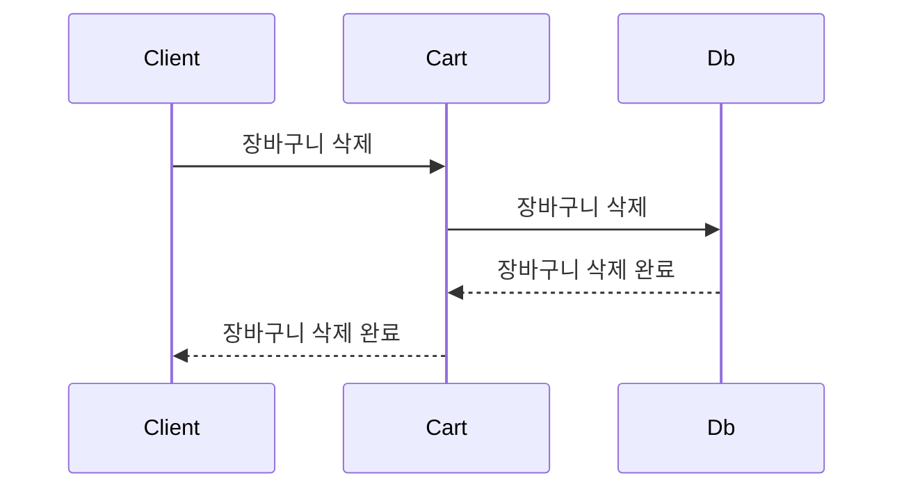
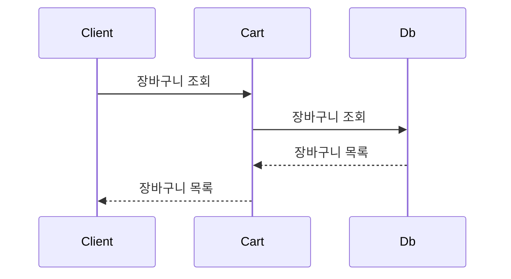
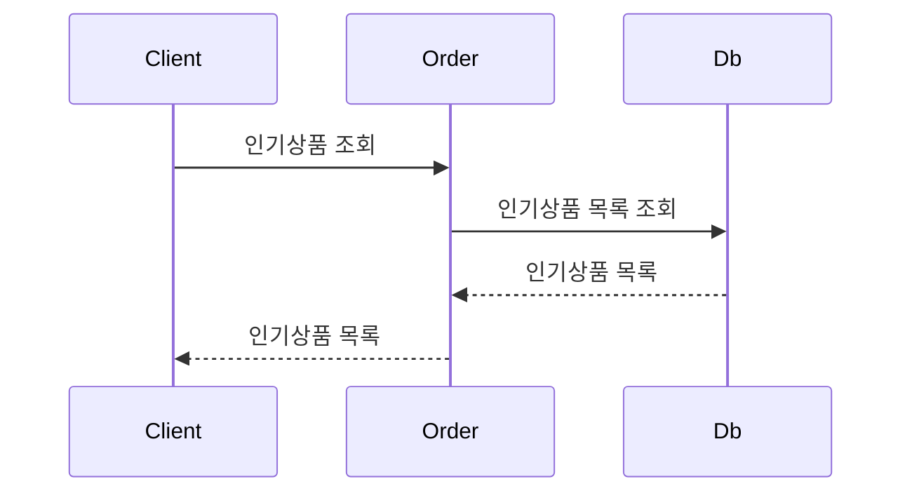
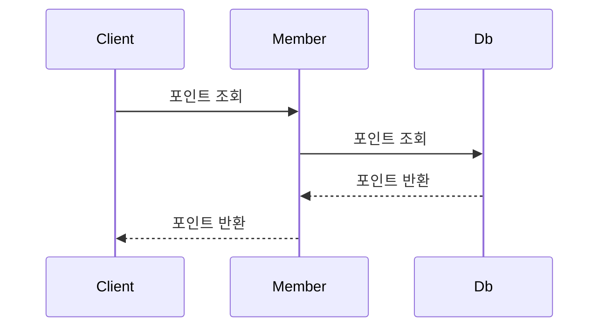
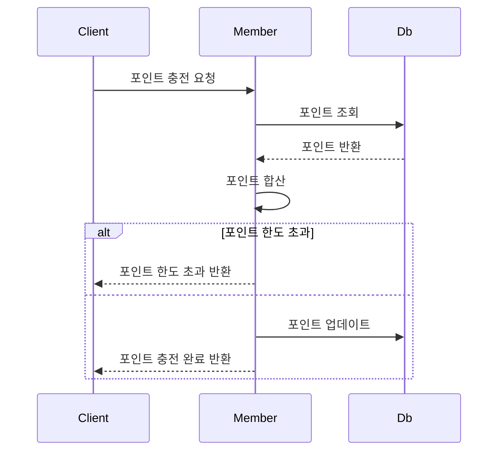
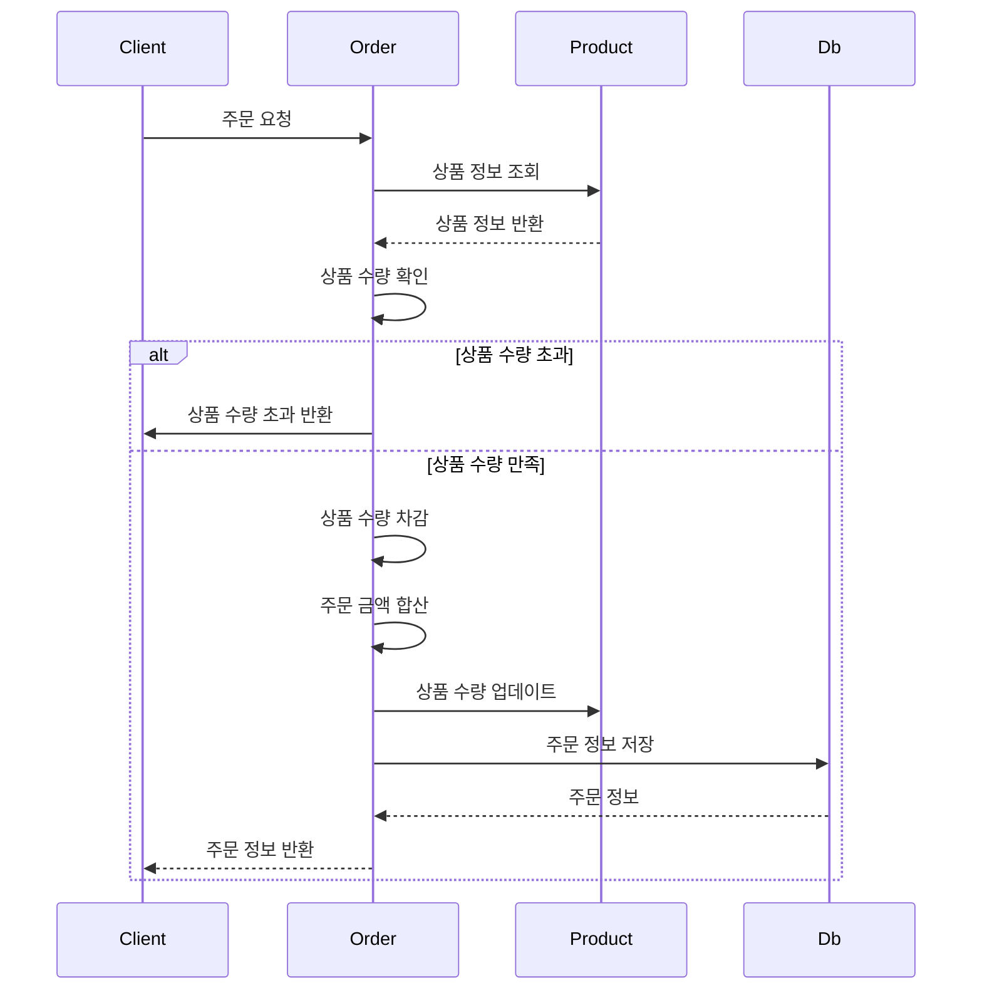
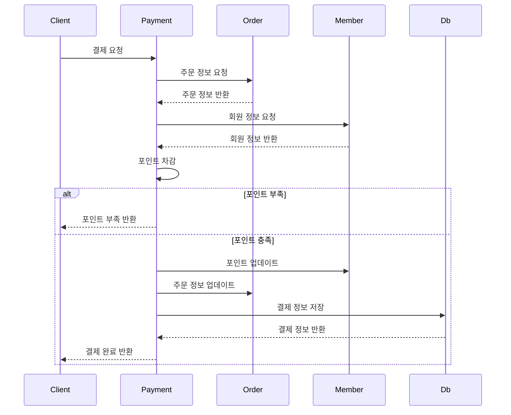

상품 목록 조회

```mermaid
sequenceDiagram
    Client->>Product:상품 목록 조회
    Product->>Db:상품 목록 조회
    Db->>Product:상품 목록
    Product->>Client:상품 목록
```

상품 상세 조회

```mermaid
sequenceDiagram
    Client->>Product:상품 ID
    Product->>Db:상품 상세 조회
    Db->>Product:상품 상세 정보
    Product->>Client:상품 상세 정보
```

장바구니 담기

# 장바구니담기

```mermaid
sequenceDiagram
    participant Client
    participant Cart
    participant Product
    participant Db

    Client->>Cart: 장바구니 등록
    Cart->>Product: 상품 수량 조회 (상품 ID)
    Product-->>Cart: 상품 수량 반환
    Cart->>Cart: 재고 확인

    alt 재고보다 많음
        Cart-->>Client: 재고보다 많음 리턴
    else 재고 가능
        Cart->>Cart: 장바구니 조회
        alt 장바구니에 이미 있음
            Cart->>Cart: 장바구니 수량 합치기
            alt 합친 수량이 재고보다 많음
                Cart-->>Client: 재고보다 많음 리턴
            else 수량 합치기 가능
                Cart->>Db: 장바구니 업데이트
                Db-->>Cart: 업데이트 완료
                Cart-->>Client: 장바구니 등록 완료 리턴
            end
        else 장바구니에 없음
            Cart->>Db: 장바구니 등록
            Db-->>Cart: 등록 완료
            Cart-->>Client: 장바구니 등록 완료 리턴
        end
    end
```

장바구니 삭제

# 장바구니 삭제

```mermaid
sequenceDiagram
    participant Client
    participant Cart
    participant Db
    
    Client->>Cart: 장바구니 삭제
    Cart->>Db: 장바구니 삭제
    Db-->>Cart: 장바구니 삭제 완료
    Cart-->>Client: 장바구니 삭제 완료
```

장바구니 조회

# 장바구니조회

```mermaid
sequenceDiagram
    participant Client
    participant Cart
    participant Db
    
    Client->>Cart: 장바구니 조회
    Cart->>Db: 장바구니 조회
    Db-->>Cart: 장바구니 목록
    Cart-->>Client: 장바구니 목록
```

인기 상품 조회(최근 3일)

# 인기 상품 조회(최근 3일)

```mermaid
sequenceDiagram
    participant Client
    participant Order
    participant Db
    
    Client->>Order: 인기상품 조회
    Order->>Db: 인기상품 목록 조회
    Db-->>Order: 인기상품 목록
    Order-->>Client: 인기상품 목록
```

포인트 조회

# 포인트 조회

```mermaid
sequenceDiagram
    participant Client
    participant Member
    participant Db
    
    Client->>Member: 포인트 조회
    Member->>Db: 포인트 조회
    Db-->>Member: 포인트 반환
    Member-->>Client: 포인트 반환
```

포인트 충전

# 포인트 충전

```mermaid
sequenceDiagram
    participant Client
    participant Member
    participant Db
    
    Client->>Member: 포인트 충전 요청
    Member->>Db: 포인트 조회
    Db-->>Member: 포인트 반환
    Member->>Member: 포인트 합산
    alt 포인트 한도 초과
        Member-->>Client: 포인트 한도 초과 반환
    else
        Member->>Db: 포인트 업데이트
        Member-->>Client: 포인트 충전 완료 반환
        end
```

주문하기

# 주문하기

```mermaid
sequenceDiagram
    participant Client
    participant Order
    participant Product
    participant Db

    Client->>Order: 주문 요청
    Order->>Product: 상품 정보 조회
    Product-->>Order: 상품 정보 반환
    Order->>Order: 상품 수량 확인
    alt 상품 수량 초과
        Order->>Client: 상품 수량 초과 반환
    else 상품 수량 만족
        Order->>Order: 상품 수량 차감
        Order->>Order: 주문 금액 합산
        Order->>Product: 상품 수량 업데이트
        Order->>Db: 주문 정보 저장
        Db-->>Order: 주문 정보
        Order-->>Client: 주문 정보 반환
        end
```

결제하기

# 결제하기

```mermaid
sequenceDiagram
    participant Client
    participant Payment
    participant Order
    participant Member
    participant Db
    
    Client->>Payment: 결제 요청
    Payment->>Order: 주문 정보 요청
    Order-->>Payment: 주문 정보 반환
    Payment->>Member: 회원 정보 요청
    Member-->>Payment: 회원 정보 반환
    Payment->>Payment: 포인트 차감
    alt 포인트 부족
        Payment-->>Client: 포인트 부족 반환
    else 포인트 충족
        Payment->>Member: 포인트 업데이트
        Payment->>Order: 주문 정보 업데이트
        Payment->>Db: 결제 정보 저장
        Db-->>Payment: 결제 정보 반환
        Payment-->>Client: 결제 완료 반환
        end
        
```

